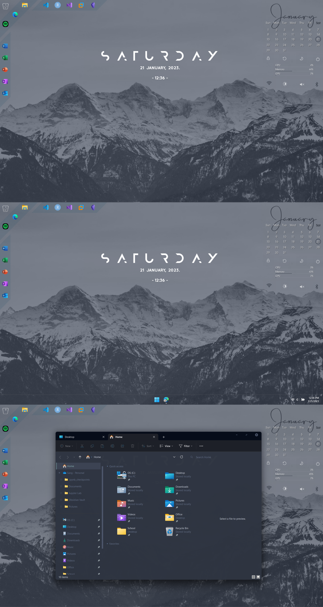
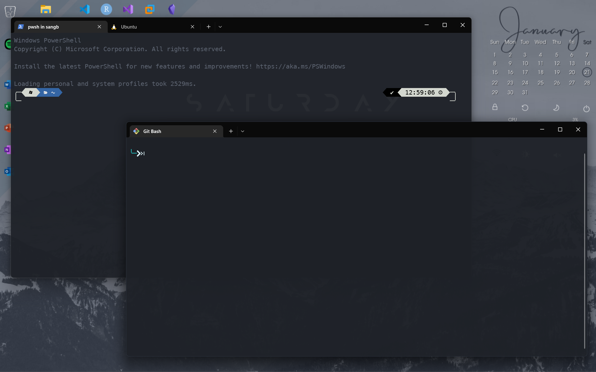
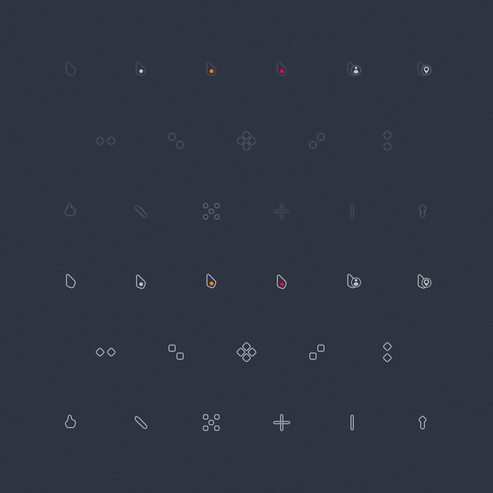
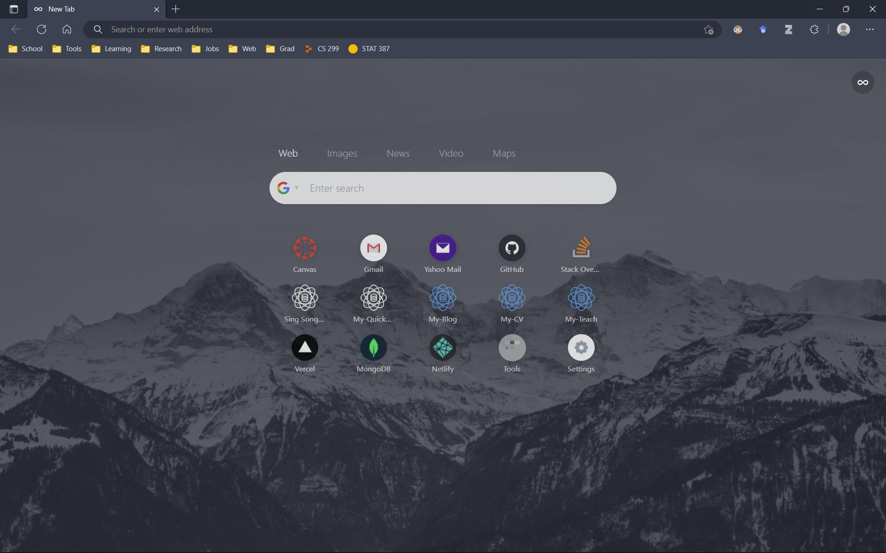
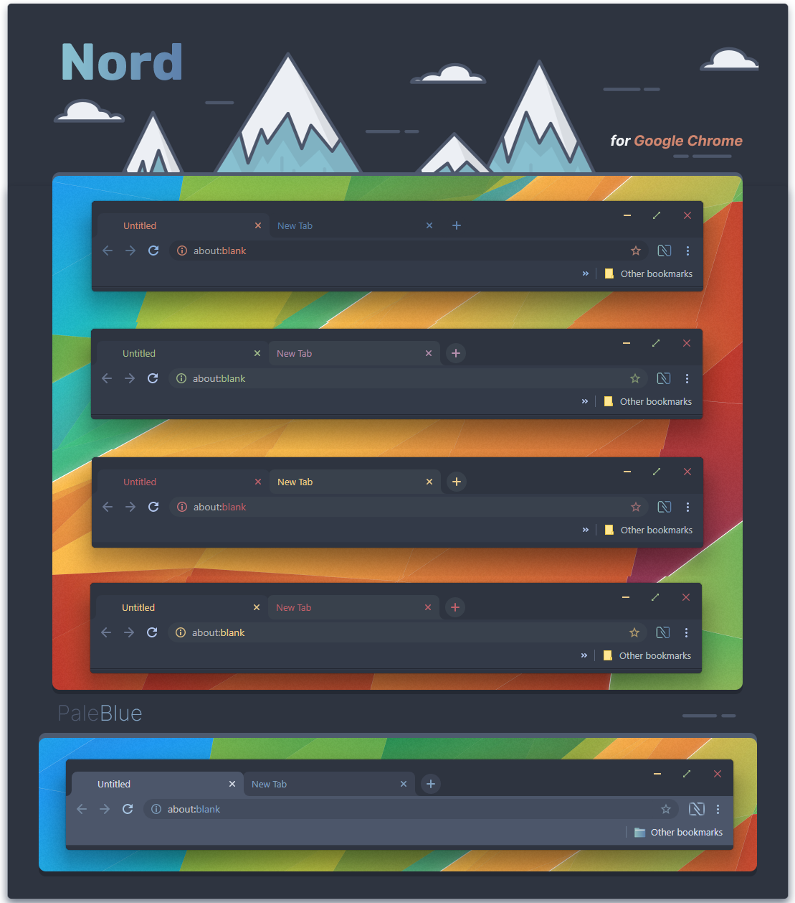

<h1 align="center">My Windows Ricing</h1>

<h2 align="center">Theme Preview</h2>

<h3 align="center">Installation</h3>

Applying theme by: 
1. Download [Rainmeter](https://www.rainmeter.net/) software
2. Download `Nord_Scheme.rmskin` from above
3. The `.rmskin` file should automatically be recognized by Rainmeter, and click on it to install.  If it's not recognized, right click on the file and open it with Rainmeter application. 
4. Install Nord theme for Windows by following this link: [Nord Theme](https://www.deviantart.com/niivu/art/NORD-for-Windows-11-22H2-928730071) (Other recommended: [One Dark Theme](https://www.deviantart.com/niivu/art/One-Dark-Pro-for-Windows-11-22H2-930312689). Note: Themes are not necessarily applicable to the entire system)

<h3 align="center">Reference</h3>

- Rainmeter Skins Creit: 
	- [Corner Dock](https://www.deviantart.com/sinndbad/art/Corner-Dock-839311234) (Note: Be sure to change icons' app directories to your owns directories by right click on corner dock, select  `settings`, the third option from context menu, and edit it in a text editor/notepad, save it and refresh the skin)
	- [Mond](https://www.deviantart.com/illu90/art/Minimalist-Desktop-880464406)
	- [Sonder](https://www.deviantart.com/michaelpurses/art/Sonder-Rainmeter-skin-838147223)
	- [TaskbarX](https://github.com/ChrisAnd1998/TaskbarX)
- Wallpaper: [Nord](https://raw.githubusercontent.com/Sang-Buster/Picgo-Github/main/img/Nord/Nord_Mt.jpeg)

<h2 align="center">Terminal Theme Preview</h2>

<h3 align="center">Reference</h3>

- Terminal Theme: [One Half Dark](https://learn.microsoft.com/en-us/windows/terminal/customize-settings/color-schemes#one-half-dark) (Other recommended: [Nord](https://github.com/thismat/nord-windows-terminal))
- Shell Prompt Theme: [Oh My Posh](https://github.com/jandedobbeleer/oh-my-posh)-[powerlevel10k_rainbow](https://ohmyposh.dev/docs/themes#powerlevel10k_rainbow). (Other recommended: [Atomic](https://ohmyposh.dev/docs/themes#atomic))

<h2 align="center">Nord Cursor Preview</h2>

<h3 align="center">Reference</h3>

- Cursor Theme: [Nordic Cursors](https://www.deviantart.com/skyeo84/art/Minimalistic-V3-nord-cursor-909562097)

<h2 align="center">Browser Homepage Preview</h2>

<h2 align="center">Browser Tab Preview</h2>

<h3 align="center">Reference</h3>

- Firefox: 
	- Tab Theme: [Minimalist Nord](https://github.com/canbeardig/MinimalistFox)
  	- Homepage Theme: [Nordic Theme](https://github.com/EliverLara/firefox-nordic-theme)
  	- New Tab Theme: [nightTab](https://addons.mozilla.org/en-US/firefox/addon/nighttab/)
- Edge/Chrome: 
	- Tab Theme: [Nord](https://www.deviantart.com/sublime9-design/art/Nord-Theme-for-Chrome-V2-837463227) (Or using this [Nord](https://chrome.google.com/webstore/detail/nord/abehfkkfjlplnjadfcjiflnejblfmmpj) theme for pure color)
	- Homepage Theme: [Infinity Pro](https://chrome.google.com/webstore/detail/infinity-new-tab-pro/nnnkddnnlpamobajfibfdgfnbcnkgngh?hl=en-US)
