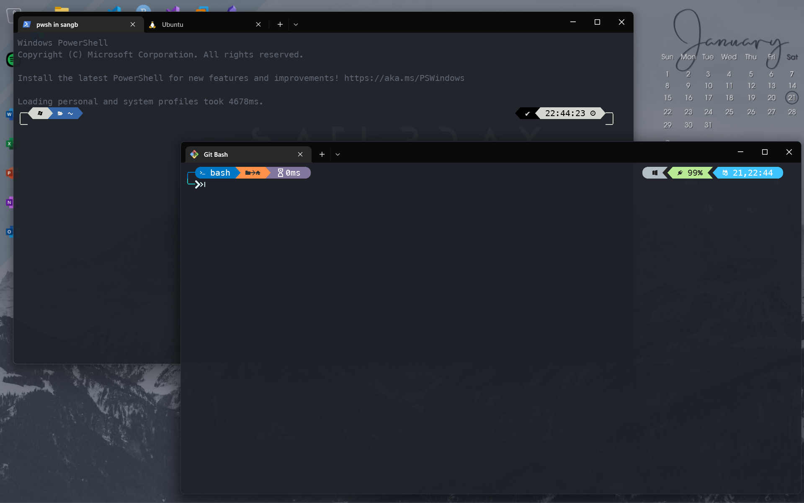
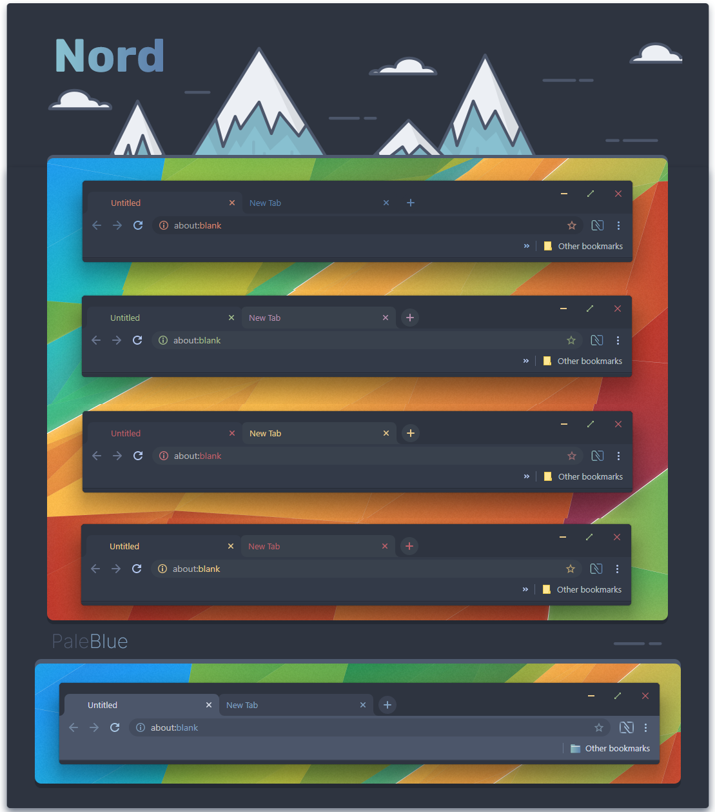

<h1 align="center">My Fedora Ricing</h1>

<h2 align="center">Theme Preview</h2>

<h3 align="center">Reference</h3>

- Rainmeter Skins Creit: 
	- [Corner Dock](https://www.deviantart.com/sinndbad/art/Corner-Dock-839311234)
	- [Mond](https://www.deviantart.com/illu90/art/Minimalist-Desktop-880464406)
	- [Sonder](https://www.deviantart.com/michaelpurses/art/Sonder-Rainmeter-skin-838147223)
	- [TaskbarX](https://github.com/ChrisAnd1998/TaskbarX)
- Windows Nord Theme: 
	- [Nord Theme](https://www.deviantart.com/niivu/art/NORD-for-Windows-11-22H2-928730071) (Other recommended: [One Dark Theme](https://www.deviantart.com/niivu/art/One-Dark-Pro-for-Windows-11-22H2-930312689))
	- [SecureUxTheme](https://github.com/namazso/SecureUxTheme)
	- [UltraUXThemePatcher](https://mhoefs.eu/software_uxtheme.php?ref=syssel&lang=en)
- Wallpaper: [Nord](https://raw.githubusercontent.com/Sang-Buster/Picgo-Github/main/img/Nord/Nord_Mt.jpeg)

---

<h2 align="center">Terminal Theme Preview</h2>

<h3 align="center">Reference</h3>

- Terminal Theme: [One Half Dark](https://learn.microsoft.com/en-us/windows/terminal/customize-settings/color-schemes#one-half-dark) (Other recommended: [Nord](https://github.com/thismat/nord-windows-terminal))
- Shell Prompt Theme: [Oh My Posh](https://github.com/jandedobbeleer/oh-my-posh)-[powerlevel10k_rainbow](https://ohmyposh.dev/docs/themes#powerlevel10k_rainbow). (Other recommended: [Atomic](https://ohmyposh.dev/docs/themes#atomic))

---

<h2 align="center">Nord Cursor Preview</h2>

<h3 align="center">Reference</h3>

- Cursor: [Nordic Cursors](https://www.gnome-look.org/p/1662218/)

---

<h2 align="center">Browser Homepage Preview</h2>

<h2 align="center">Browser Tab Preview</h2>

<h3 align="center">Reference</h3>

- Firefox: 
	- Tab Theme: [Minimalist Nord](https://github.com/canbeardig/MinimalistFox)
  	- Homepage Theme: [Nordic Theme](https://github.com/EliverLara/firefox-nordic-theme)
  	- New Tab Theme: [nightTab](https://addons.mozilla.org/en-US/firefox/addon/nighttab/)
- Edge/Chrome: 
	- Tab Theme: [Nord]([Nord Theme for Chrome V2 by sublime9-design on DeviantArt](https://www.deviantart.com/sublime9-design/art/Nord-Theme-for-Chrome-V2-837463227))
	- Homepage Theme: [Infinity Pro](https://github.com/EliverLara/firefox-nordic-theme)
